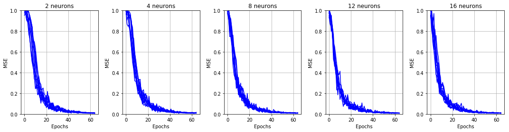
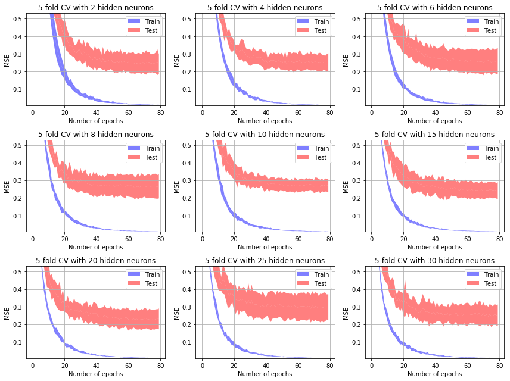
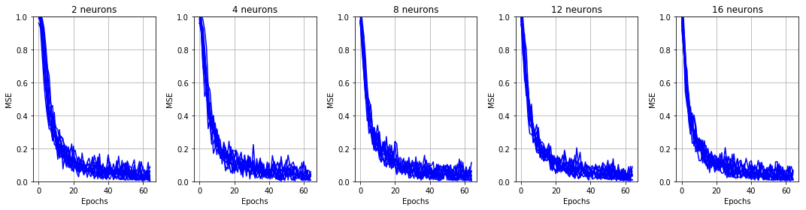
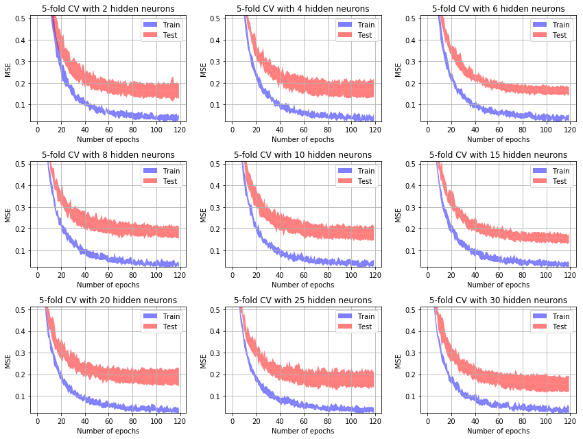
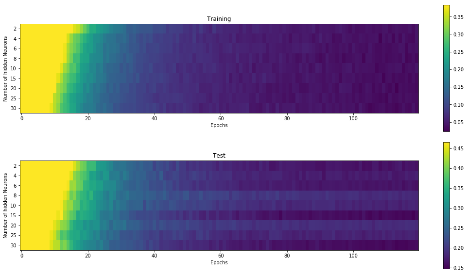
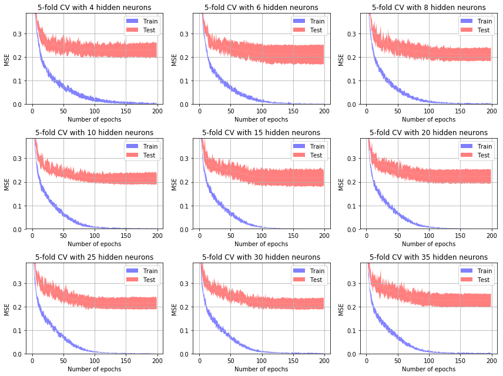
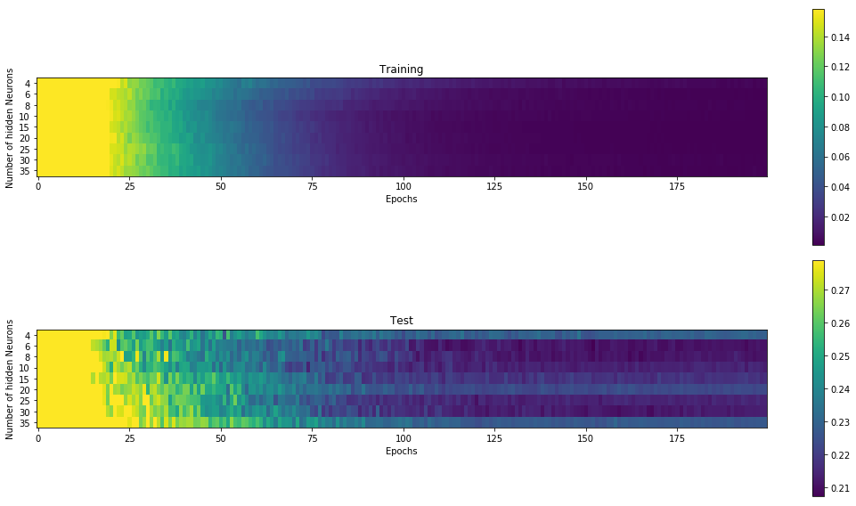

# Machine Learning 20: Practical work 3

> Simon Mirkovitch, Tiago Povoa Quinteiro 

# Practical work 03 - Speaker recognition using Neural Networks and Supervised Learning 

## Questions: points 1 and 2

We answered the questions in the notebook `Answers to questions.ipynb`

## Goal

> You will be provided with a database of vowels spoken by men, women and children (of 3, 5 and 7 years old). The task will be to train artificial neural networks to recognize the speaker having produced the given sounds and evaluate its performance (e.g., by crossvalidation). 


> 0. For each of the following experiments, provide a brief description of the number of observations of each class, the features being used to train the model, the procedure (explain) for selecting the final model (e.g., use the model_building.ipynb notebook), the description of the final model and its evaluation (i.e., provide the cross-validation results, the confusion matrix and the F-score). Comment your results. 

## Protocol

In this section, we'll make a small overview of the protocol we used.

We took inspiration from `9_model_selection.ipynb` notebook.

* Extraction
  * Categorizing the sound by matching patterns in the name files
    * Applying a class to each
  * Processing the sound samples with MFCC
  * Extracting features: median, standard deviation...
  * Normalizing the features with sklearn's MinMaxScaler
  * Displaying it with pandas (dataframe)
* Exploring configuration:
  * Running some tests to find from where the epochs start to lower
  * Finding a learning rate, momentum and a number of hidden neurons
* Evaluating
  * Analyzing the plots
  * The confusion matrix
  * and finally evaluating F-Score and other metrics

## Part 1

> 1. Man vs Woman. Use only the natural voices of men and women to train a neural network that recognizes the gender of the speaker. 

### In brief

* All the data is in a dataset (np.hstack)
* Labeled Female=1 and Male=-1
* Two features: median and std. Probably we could use only one
* Normalized with MinMaxScaler from sklearn.preprocessing (between -1 and 1)
* Used the hyperbolic tangent as the activation function

### Find the correct configuration

In this section, we'll discuss how we found the correct number of epochs, learning rate and momentum.

#### Features

By testing both with one and two features, we didn't see much difference. It could signify that we are overfitting. We'll see in the following sections that it doesn't look so bad, though. We'd need to test deeper to compare.

#### Normalization

As we started, we had some issues because of misconfigurations.

We forgot to use normalization at first. Without it, we observed that the problem was way harder than it's supposed to be. It was really impressive how much difference it made by correctly providing our features to the training process.

#### Epochs

By running with default parameters `Learning_rate=0.1, Momentum=0.5`, it was clear that the problem didn't need much epochs. From 200, we went way to 120, then 80 and finally 65 as we tuned better and better our parameters.

#### Learning rate and Momentum



As we can see in the graphs above, we managed to bring the mean squared error pretty low. 

Our approach was to test various values of learning rate by steps of 0.001 and various momentum values by steps of 0.1. 

Here we can see the result of an execution with:

```python
LEARNING_RATE = 0.012 
MOMENTUM = 0.5 
```

#### Hidden neurons

In this section, we tested with the **k fold cross validation** how many neurons we should put in the hidden layer.



The more convincing was the configuration with 10 hidden neurons. 


In the graph above, we see that the **MSE** is also very low for 20 hidden neurons. 

### Results

#### Confusion Matrix

In our first experiments, we obtained the following confusion matrix:

```
[[35.  1.]
 [ 7. 29.]]
```

And with the final tuning we arrived at:

```
[[36.  0.]
 [ 2. 34.]]
```

Over 72 files read.

---

Here follows the final result we had at the moment of calculating the F-Score

```
MSE training:  0.005667937398719769
MSE test:  0.22138032353091514
Confusion matrix:
[[35.  1.]
 [ 4. 32.]]
```

#### F-Score

As we can see in the table below, our scores are very close to 1.0. And we still stayed low on epochs.

```
              Women       Man
Precision  0.972222  0.888889
Recall     0.897436  0.969697
F-Score    0.933333  0.927536
```

>  Source on how to calculate those values: https://machinelearningmastery.com/precision-recall-and-f-measure-for-imbalanced-classification/

## Part 2

> 2. Man vs Woman, using both natural and synthetic voices. Proceed as explained in 0. 

### In brief

Same as the part 1 but the data contains voices of natural and synthetic adults. We didn't take this new distinction into account. We only differentiated men and women.

### Find the correct configuration

In this section, we'll discuss how we found the correct number of epochs, learning rate and momentum.

#### Features and Normalization

Same as part 1

#### Epochs

200 epochs are  not needed here. We tested again with 200, 120, 80 and 65 epochs and we saw that 65 epochs are enough to do the job correctly.

#### Learning rate and Momentum



On the plots, we can see that we didn't manage to bring the mean squared error as low as in the part 1. But it should be enough to solve the problem.

Our approach was the same as the part 1: test various values of learning rate by steps of 0.001 and various momentum values by steps of 0.1. 

Here we can see the result of an execution with:

```python
LEARNING_RATE = 0.014
MOMENTUM = 0.5
```

#### Hidden neurons

In this section, we tested with the **k fold cross validation** how many neurons we should put in the hidden layer.



The 2, 6, 15 and 30 hidden neurons configurations seem good. The below graph helped to choose the best configuration

We can see that the **MSE** is also very low for 6, 15 and 30 hidden neurons on the test graph. To avoid a too complex program, we decided to use the 15 hidden neurons configuration

### Results

#### Confusion Matrix

The confusion matrix of the initial configuration was

```
[[60.  12.]
 [ 11. 61.]]
```

With our configuration, we obtain

```
[[69.  3.]
 [ 4. 68.]]
```

* True positif 69.
* False negative 3.
* False positive 4.
* True negative 68.

Over 144 files read

---

The confusion matrix at the moment we calculated the F-Score:

```
MSE training:  0.03475438926340483
MSE test:  0.1544948951021063
Confusion matrix:
[[69.  3.]
 [ 5. 67.]]
```

#### F-Score

We consistently arrive above 0.93, which seems good. Still low epochs, and not using a lot of hidden neurons.

```
              Women       Man
Precision  0.958333  0.930556
Recall     0.932432  0.957143
F-Score    0.945205  0.943662
```

## Part 3

### In brief

Since we have 3 categories, we couldn't use Female=1 and Male=-1.

This time we have: Female=[**1**, -1, -1], Male=[-1, **1**, -1], Kid=[-1, -1, **1**]

* We used only the natural voices.

We tried with two features and it was clearly not enough. Here is the confusion matrix as an example:

```
[[ 35.  31.  34.]
 [ 27.  36.  18.]
 [ 79.  26. 108.]]
```

* Four features: Median, std, minimum and maximum

* Normalized with MinMaxScaler from sklearn.preprocessing (between -1 and 1)
* Used the hyperbolic tangent as the activation function

### Find the correct configuration

#### Number of Epochs

This time, we went all the way to 200 Epochs. It started to look good only after 150.

#### Learning rate and Momentum

* Learning rate = 0.01 
* Momentum = 0.5 

We tried a few values. By adding two more features, it was easier to get the MSE down. Still, we have a high learning so it could cause problems. 

#### Hidden neurons

Below, we can see that the test error is consistently  above 0.2. But the blue curve is going down very quickly. This is symptomatic of a scenario of overfitting.

We have a lot of difficulty at getting stable in the test gradient.



This graphs show that our model is not very good. We compromised a bit too much on epochs to stay low. This compromise made us use a higher learning rate and momentum which clearly indicates an overfitting scenario. If we had more time to improve our experience we could explore this way.

### Results

#### Confusion Matrix

```
Run A
MSE training:  0.0013294478379767363
MSE test:  0.21362182575080285
Confusion matrix:
[[ 27.   1.   5.]
 [  4.  34.   0.]
 [  8.   1. 102.]]
 --------------
Run B
MSE training:  0.0031006361188264196
MSE test:  0.21122603197906184
Confusion matrix:
[[ 31.   2.   4.]
 [  4.  35.   0.]
 [  9.   0. 100.]]
```

For a total of 180 files. 

As we mentioned before, the model isn't really good. But still, we managed to get a lot of children right. The confusion matrix does not look "as bad" as we could expect. Of course, if we run it multiple times, the confusion matrix might change a bit. 

#### F-Score

Here is a recap table of our experiment. 

|           | Women    | Man      | Children |
| --------- | -------- | -------- | -------- |
| Precision | 0.837838 | 0.897436 | 0.917431 |
| Recall    | 0.704545 | 0.945946 | 0.961538 |
| F-Score   | 0.765432 | 0.921053 | 0.938967 |

Our model seems to handle well children and man voices. But it fails by some huge gap to identify properly women.

We could imagine, however totally an intuition to take with a grain of salt, that some features of male and children voices make them both at the end of some spectrum. And so, that could explain why our model is worse at predicting women voices who go in between.

## Part 4

> 4. Design a final experiment of your choice (e.g., using your own voice). Proceed as explained in 0. 

In this part, we used the trained model of the part 3 to see if it would be robust enough. 

We used some adult voices to field test it.

## Conclusion

The first goal we had was to reduce the number of epochs: since we had no prior experience of the mystical art of machine learning, we had to try a lot of different values for both the learning rate and momentum. This was really time consuming and so we had to make this first compromise.

In part 1, two features might have been too much. Maybe one was sufficient. In part two, it looked good this way. And in part 3 we had to go up to four features because the problem was way harder. 

In part 3, we clearly had an overfitting problem. We could have solved it with a bit more epochs, a better configuration by exploring lower learning rate value. If we had to do it again we would explore this way.

In general, it would be nice to have a **MSE** lower in the test plots. It was almost always between 0.3 and 0.2.